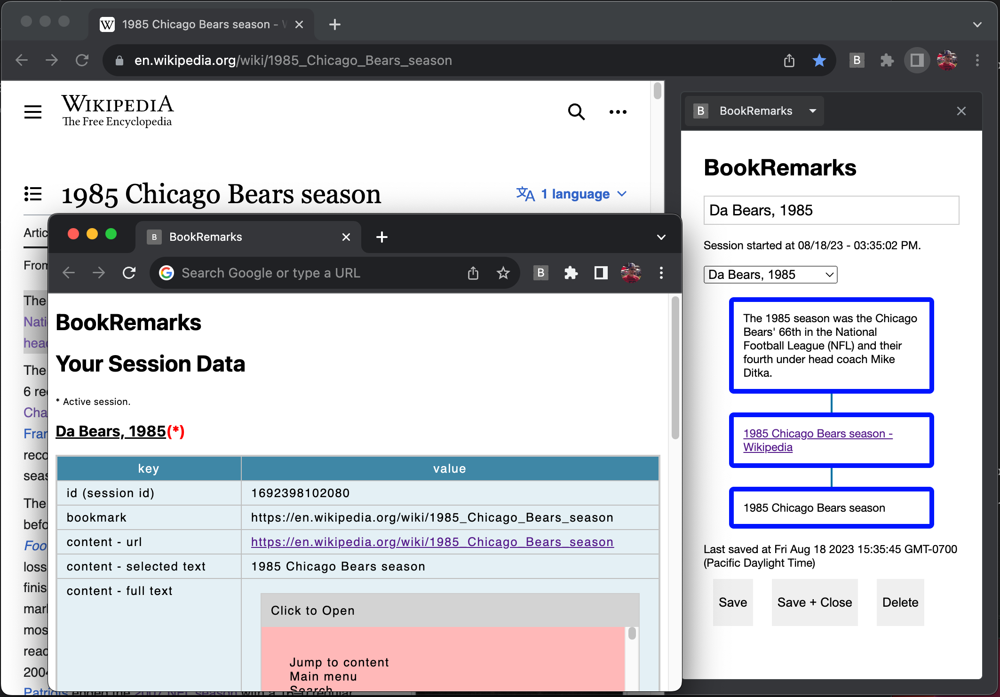

# BookRemarks

A better way to track content via bookmarking and content capture.

# Summary

A Chrome extension groundwork, building towards a tool to help organize captured data for ease of use later.

# Use Cases

- To visualize content you deemed important for your research.
- To keep related bookmarks near each other is space.

# Installation

- Navigate to chrome://extensions.
- Enable developer mode toggle.
- Click "Load unpacked" and open the containing folder.

# Usage

- Click the Chrome Side panel button to open it.
- Click "BookRemarks" from the dropdown.
- If your page is already open, refresh the page.
- Highlight text you wish to capture. Captured on mouseup.
- Capture a bookmark as normal.

# v0.2.0

- Adding IndexedDB storage to replace localStorage.
- Added session handling.
- Code refactoring to start to further pull rendering code away from data interaction code. timelineRenderer.js added.
- Additional styling created for both the side panel, and about:blank/new tab views.
- manifest versioning updated to reflect Github version. Added version_name to allow for alphanumeric entry. See https://developer.chrome.com/docs/extensions/mv3/manifest/version/.
- saveDummyObject() added to help with debugging.
- Additional timeline functionality added.

# v0.1.0

- Initial code. Minimal features with focus on showing the overall concept. Highlighted text would be captured to the timeline in the sidepanel. Bookmark creation would be captured as well. Metadata about these events would be captured. Data saved into Chrome localStorage as an example.
